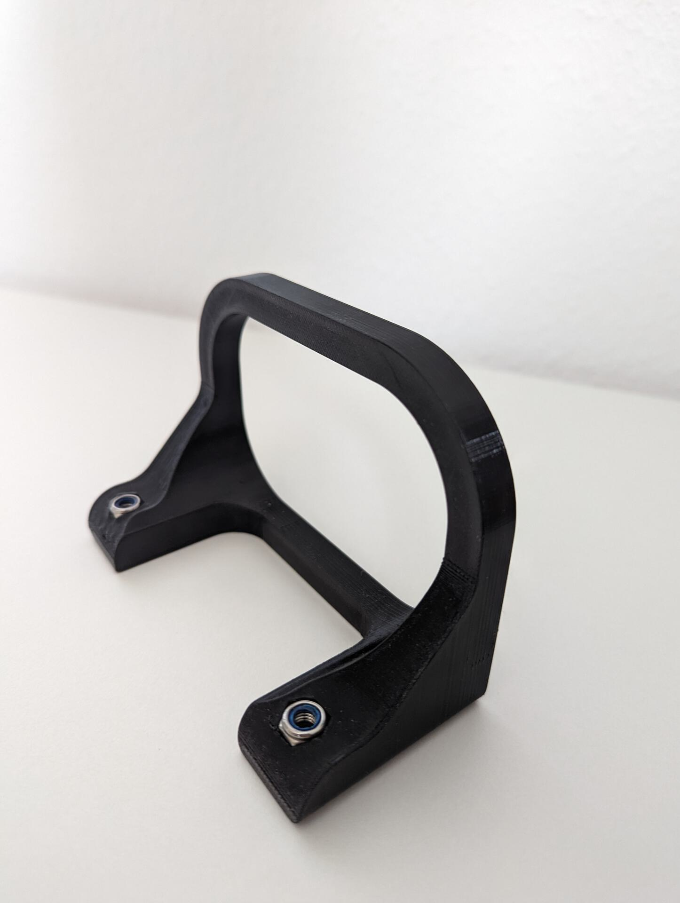

CSL DD Playseat protection brace
================
This brace is designed to prevent the CSL DD from getting damaged when used with the playseat challenge. When using the CSL DD on the playseat challenge it becomes susceptible to toppling over.

Furthermore it is intended to protect the connectors in the back of the CSL against accidental damage.

Depending on the mounting position of the CSL DD on the baseplate use either `csl_dd_protection.stl` or `csl_dd_protection_long.stl` which provides a greater distance to back of the CSL DD.
Requires two M6 nuts and two M6x20mm or M6x25mm screws to be mounted to the baseplate.

Longer version `csl_dd_protection_long.stl`

Both versions in comparison.

Mounted to the playseat challenge using M6x25mm screws. M6x20mm is recommended.