Fanatec Clubsport Pedals V3 Clutch delete
================

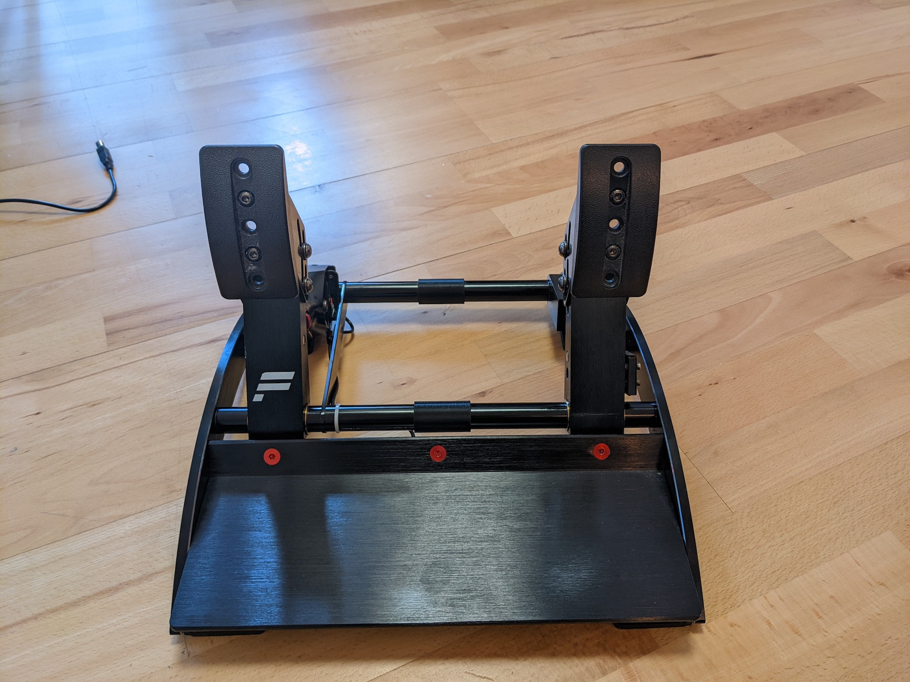
Finished product

You will need two spacers. Use either `csp_v3_clutch_delete_original` which have the same dimensions as the clutch pedal they replace. Or use  `csp_v3_clutch_delete.stl` which are 0.5mm longer and eliminate some of the play in the pedals.

<h2 id="overview">Assembly Instructions</h2>

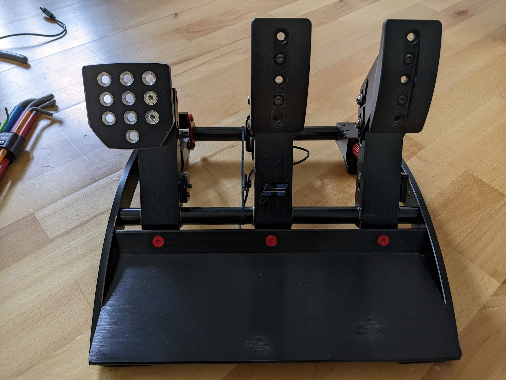
Start by removing the left (clutch side) sideplate.
There are four red screws. Use a good hex key since threadlocker has been used on the screws and the screw heads are soft.
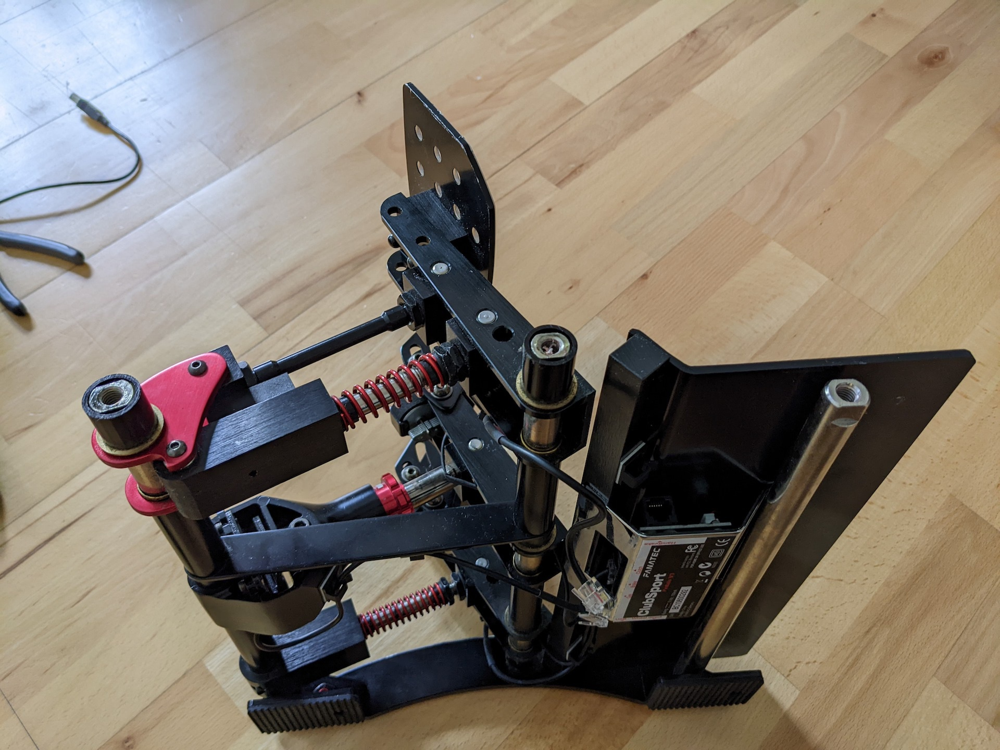
Unscrew the three red screws and remove the front footrest.
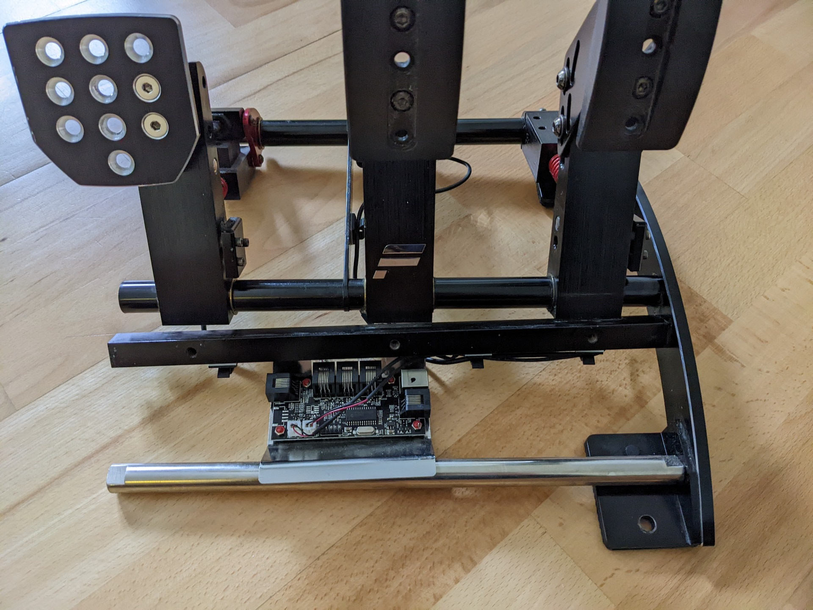
Unplug the RJ11 brake pedal loadcell cable.
Unplug the brake pedal vibration motor (left small white connector).
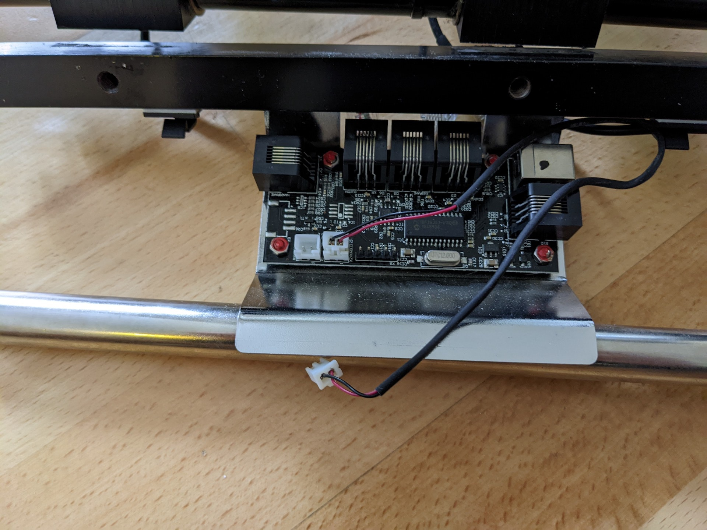
Remove the clutch pedal, the two small spacers and the two larger spacers from the two left rods.
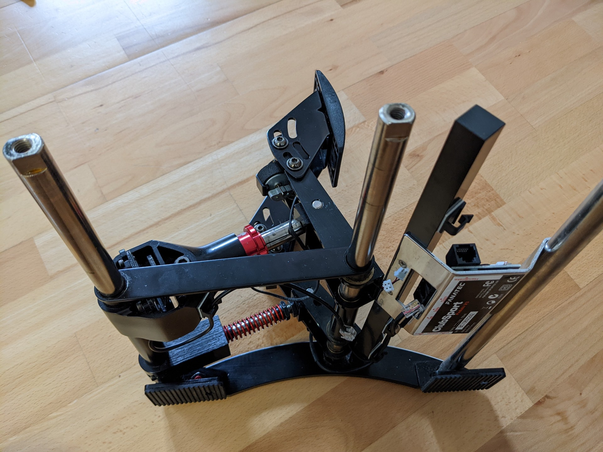
Unclip the loadcell cable from the stiffening plate and remove the stiffening plate altogether.
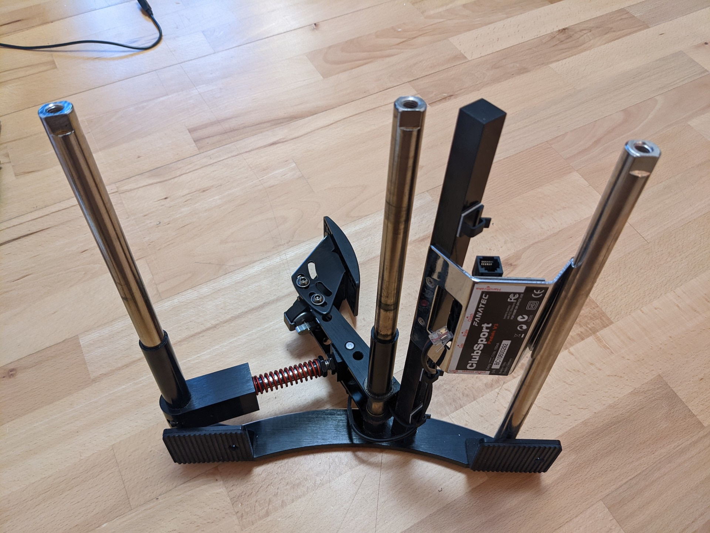
Add the two 3D printed spacers onto the rods.
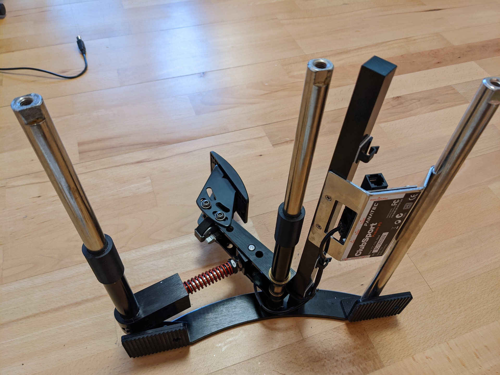
Add the two large spacers onto the rods. Make sure that they reach the same height. The large metal spacers for the gas pedal have different lengths. Swap them if they don't line up.
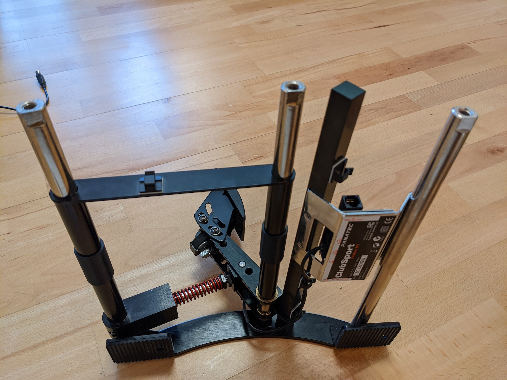
Add the stiffening plate. And add the brake pedal assembly. Rotate the loadcell assembly 180° for easier cable management. Make sure the brass bushings are sitting correctly inside the actual brake pedal.
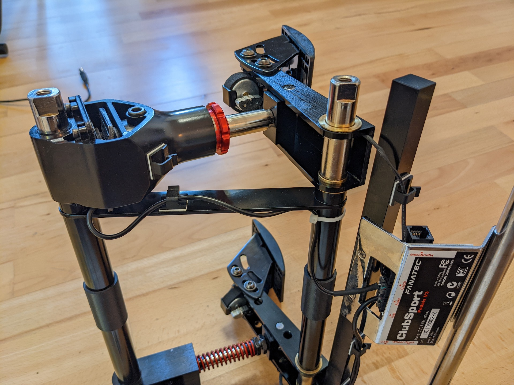
Secure the loadcell cable in the stiffening plate and cable tie to the center rod. Plug the RJ11 connector into the main pcb.
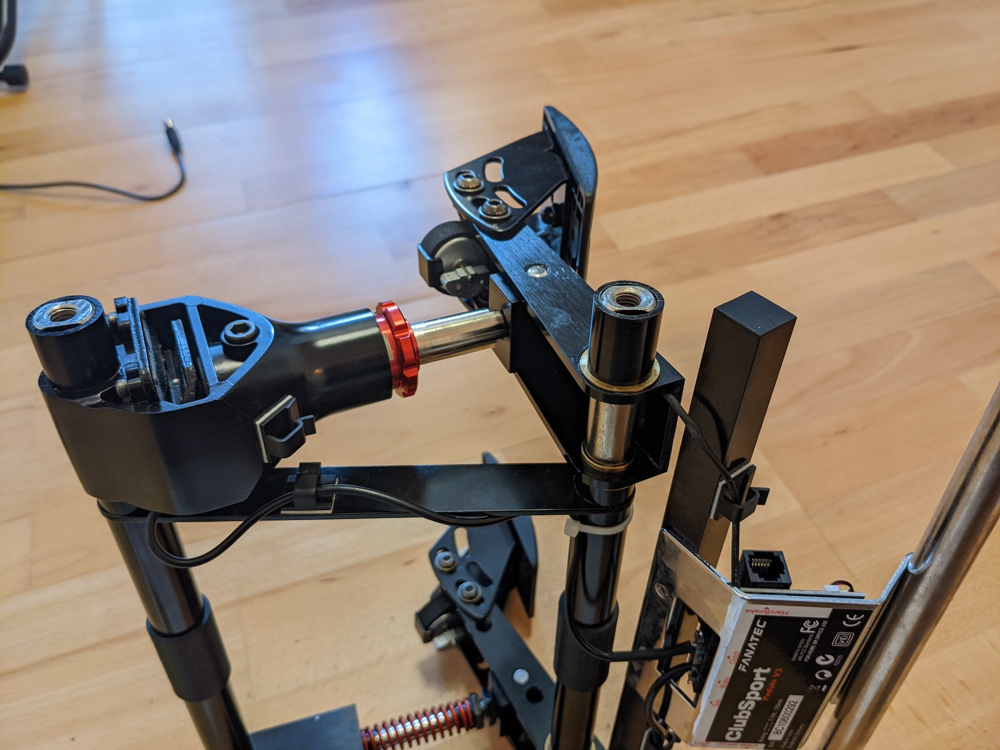
Add the remaining small metal spacers. Verify that there is little to no gap between the top of the spacer and the top of the rod.
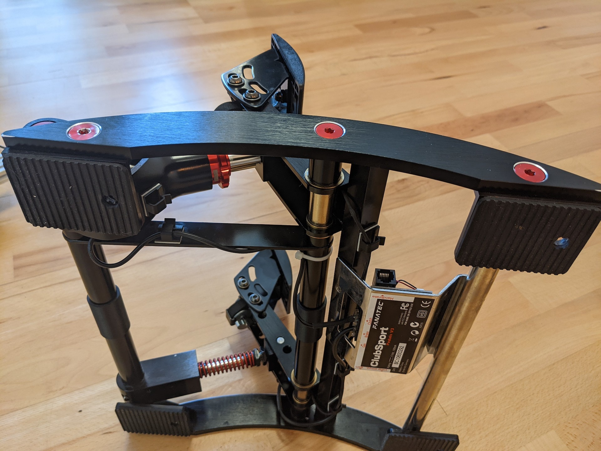
If you have larger fasteners for mounting the pedals to your rig check the clearance while mounting the sideplate. It might also be easier to add the mounting fasteners now, since access is limited when the sideplate with the mounting points is installed.
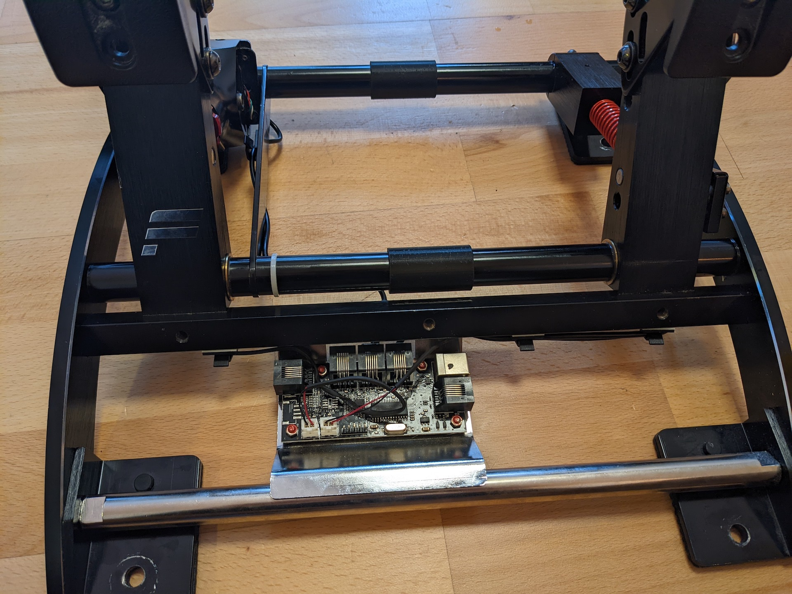
Plug in the remaining brake pedal vibration motor

Add the footrest plate and the clutch delete is  finished. 
