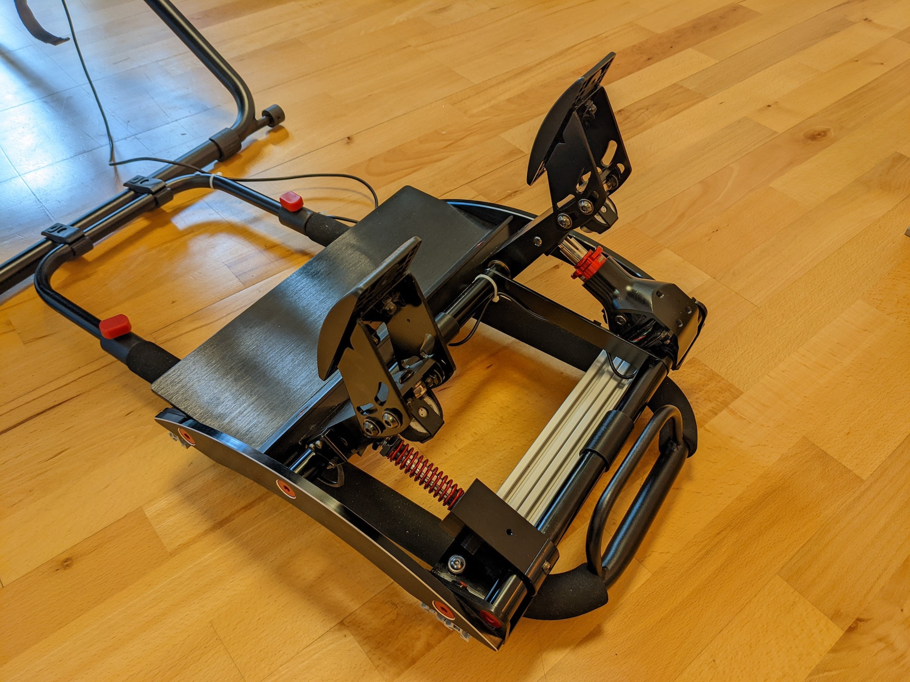
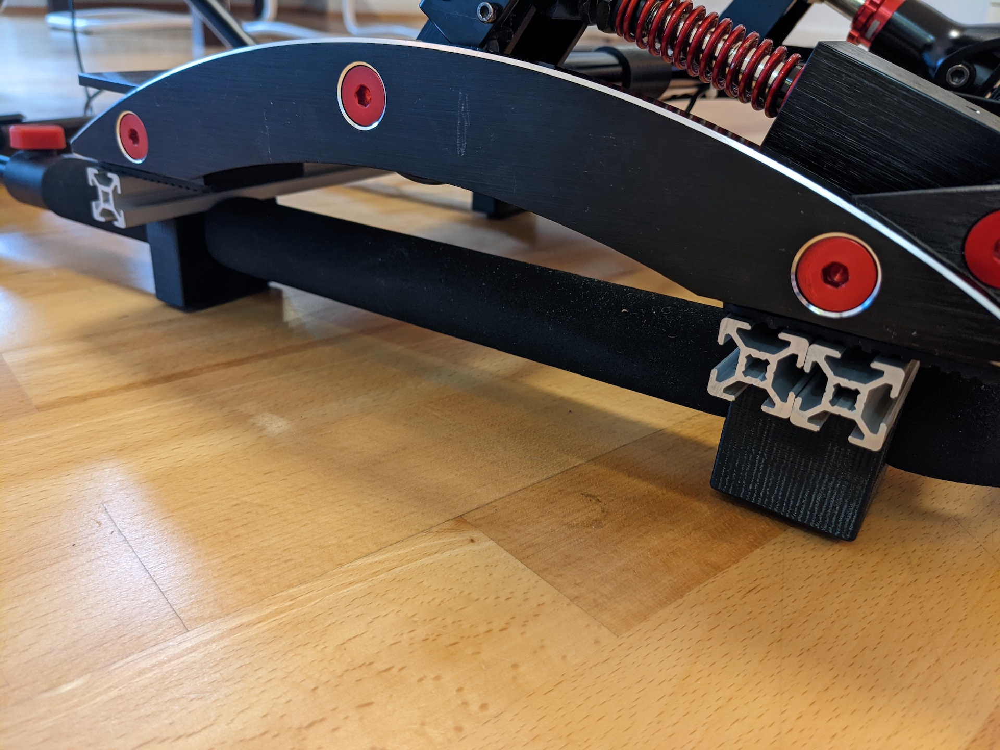
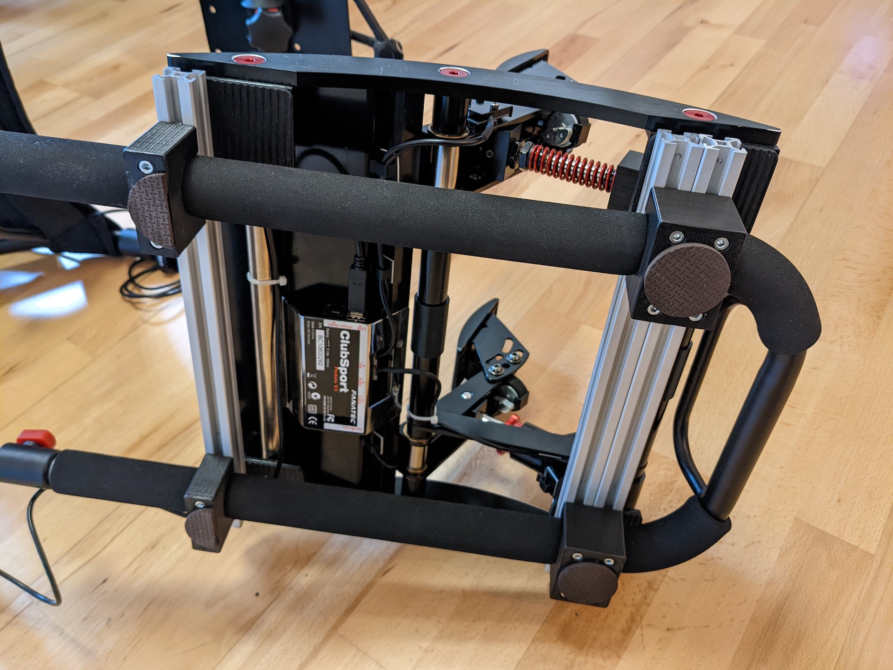

ClubSport Pedals V3 Playseat Challenge Mount
================
A set of mounts designed to rigidly mount the Fanatec Clubsport V3 pedals to the Playseat Challenge. Designed to be used together with 20x20 or 40x20 (dual 20x20) aluminum extrusion profile.

Use `csp_v3_pedal_mount.stl` for 20x20 extrusion and `csp_v3_pedal_mount_double.stl` for 40x20 extrusion. The parts are design to be used with M4 bolts.

Finished Setup

The brackets clamp the rubber of the Playseat tube to prevent any movement. They leave an imprint in the rubber after some time. The pedals are mounted to the aluminum extrusion using the standard mounting holes in the pedals. 

Single Mount with 20x20 extrusion profile on the left. Dual Mount for dual 20x20 extrusion profile or 40x20 profile on the right. Add adhesive rubber feet to prevent the mount from sliding.