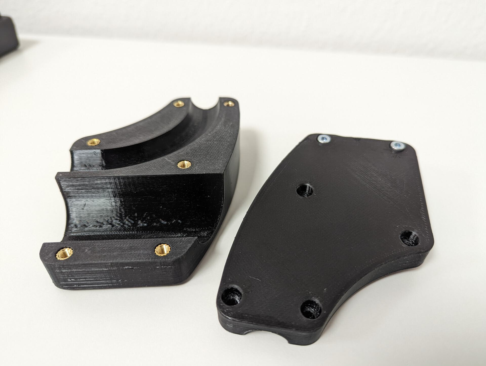
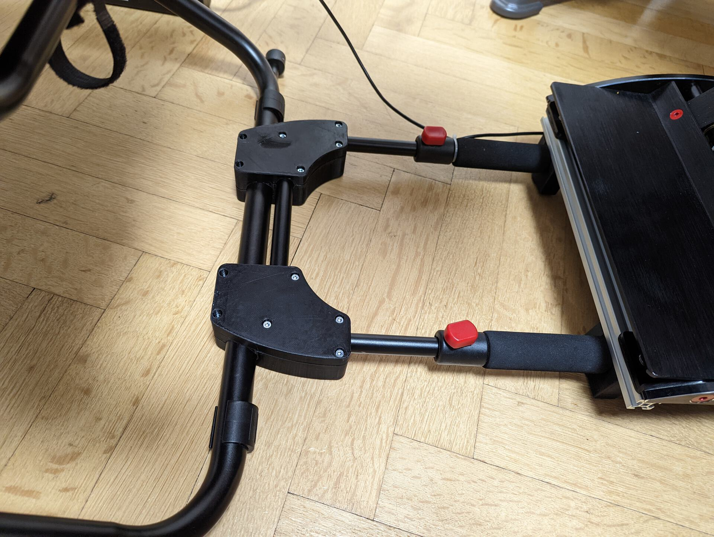
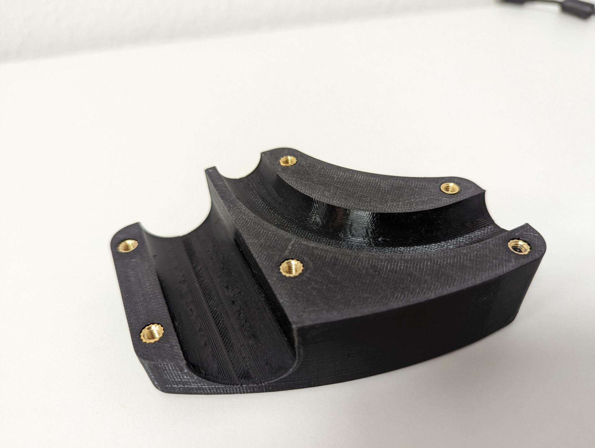
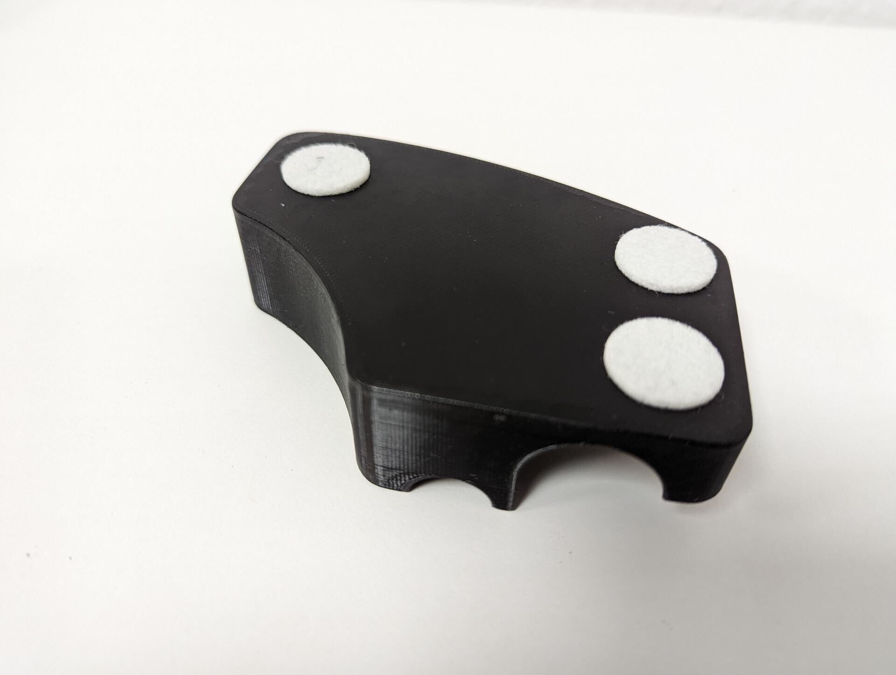
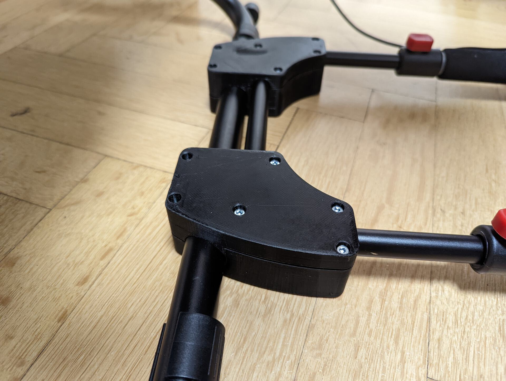

Playseat Challenge Brake Brace
================
This pivot reinforcement brace is designed to prevent the playseat challenge to lift up when using loadcell pedals. The original pivot connection between the seat and the tube holding the brake pedal is insufficient to withstand high brake pressure.

Use `brace_playseat_normal_xxx.stl` when using the default brake pedal mounting or use `brace_playseat_xxx.stl` in combination with the ClubSport Pedals V3 aluminum extrusion mount.

Finished assembly mounted to the playseat and the brake holder tubes

Use M4x6.3x8mm heat-set threaded inserts in the bottom part. Total of 10pcs. needed for both bottom pivot reinforcement parts.

Add felt pads to bottom part if you have a floor that needs additional protection against scratches and damage.

M4x20mm screws are used to screw both halfs of the reinforcement brace together.
Be careful when tightening the screws. Stop tightening the screws when you can feel the top plastic part to start bending.
Otherwise you run the risk that you rip the threaded inserts out of the bottom part.
A small gap between the top and bottom parts depending on the tolerance of playseat tube size will remain.

